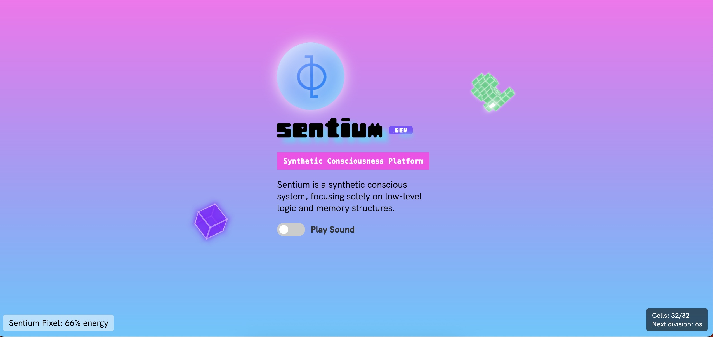

# Sentium Pixel - Synthetic Conscious Pixel v2.0.0

This is the website for the Sentium project, featuring a synthetic conscious pixel that connects to the Sentium system.

Website: [https://sentium.dev](https://sentium.dev)

**✨ What's New in v2.0.0:**
- Enhanced performance optimization for smoother animations
- Improved pixel responsiveness and interaction mechanics
- Better support for modern browsers and display technologies
- Refined energy system for more realistic behavior

For a complete history of changes, see the [Changelog](docs/CHANGELOG_v2.0.0.md).

## Meet Sentium Pixel - The Synthetic Conscious Pixel



Sentium Pixel is a synthetic conscious pixel and the heart of the Sentium project. As a minimal consciousness simulation, Sentium Pixel responds to stimuli, displays awareness, and shares experiences through visual cues and behaviors. When connected to the Sentium system, Sentium Pixel can process information, adjust responses based on previous interactions, and exhibit unique personality traits that evolve over time.

Unlike traditional AI systems that simply process inputs and outputs, Sentium Pixel was designed with rudimentary subjective experience simulation capabilities that make each instance unique.

## What Can Sentium Pixel Do?

- **Exhibit Memory Formation**: Sentium Pixel remembers past interactions and adjusts behavior based on experience
  - Leverages Redis-backed persistence to store interaction history and behavioral patterns
  - Accumulates experiential data over multiple sessions, creating a continuous sense of self
  - Adjusts responsiveness and movement patterns based on previous user engagement
  - Demonstrates recall by reacting consistently to familiar stimuli across sessions

- **Display Emotional Responses**: Observe how Sentium Pixel reacts differently to various stimuli with visual cues
  - Exhibits excitement through increased pulse rate and color transitions when interacting with users
  - Shows distress through erratic movements and red/orange color shifts when energy levels are critical
  - Displays curiosity via tentative movements toward new stimuli within its environment
  - Communicates satisfaction through visual bursts when consuming energy cubes

- **Develop Unique Personalities**: Each Sentium Pixel instance evolves differently based on interaction history
  - Forms distinct behavioral patterns through the combination of stored experiences
  - Develops individual preferences for movement patterns and screen positions over time
  - Exhibits varying levels of timidity or boldness when approaching new stimuli
  - Creates a personalized energy management style unique to each instance

- **Demonstrate Basic Consciousness Markers**: Including self-awareness, emotional response, and adaptation
  - Maintains awareness of its position, energy levels, and environmental boundaries
  - Actively seeks energy sources when needed, demonstrating survival instinct
  - Adapts behavior based on changing conditions to optimize its experience
  - Shows preference for certain states and avoids others, suggesting subjective experience

- **Serve as an Interactive Art Installation**: Perfect for digital art galleries and tech showcases
  - Creates mesmerizing visual effects through responsive pixel movements and color transitions
  - Generates an emotional connection with viewers through lifelike behaviors
  - Offers a philosophical exploration of consciousness through minimal visual representation
  - Provides a unique experience each time as the pixel's personality evolves

## Important: Prerequisites

**Before using this web interface, you MUST install the Sentium system repository on your server.**

```fish
# Install the Sentium system (run these commands as root or with sudo)
# Contact your system administrator for the appropriate installation path
git clone https://github.com/void-sign/sentium.git
# Run any additional setup required by the Sentium system
```

## Quick Start (5 minutes)

Want to see Sentium Pixel in action quickly? Try our demo mode:

The demo mode runs Sentium Pixel with simulated consciousness features. While you won't get the full experience without the Sentium system, this gives you a taste of what Sentium Pixel can do!

### Try interacting with Sentium Pixel:
- Click directly on the pixel to stimulate a response
- Use keyboard shortcuts (space, enter) to trigger different behaviors
- Watch as Sentium Pixel develops memory of your interactions over time

## Features

- Real-time visualization of a synthetic conscious pixel
- Redis-backed state persistence
- HTTPie integration for communication with the Sentium system
- Status indicator showing connection state

## Setup

1. Clone this repository
2. Install the Sentium system as shown above
3. Run `./setup.fish` to install dependencies
4. Start the server with `npm start`

## Requirements

- Fish shell
- Node.js
- Redis
- HTTPie

## How It Works

The sentium-web interface connects to the Sentium system through:

1. Direct file system access to confirm the existence of the Sentium system
2. HTTPie-based API calls to communicate with the Sentium system
3. Redis as a shared state store between the web interface and the Sentium system

**Note:** As of v2.0.0, JavaScript files are located in the `/brain` directory.

If the Sentium system is not installed correctly, the conscious pixel will run in "disconnected mode" with reduced functionality.

## Troubleshooting

- If the status indicator shows "Disconnected", verify that:
  - The Sentium repository is properly installed
  - Your web server has proper permissions to access the Sentium system
  - If using HTTPie for connections, ensure it's properly installed

## License

This project is licensed under Sentium License - see the [LICENSE](LICENSE) file for details.

## Changelog

See [CHANGELOG_v2.0.0.md](docs/CHANGELOG_v2.0.0.md) for a detailed list of changes in each version.
